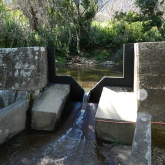

<!-- README.md is generated from README.Rmd. Please edit that file -->

```{r, include = FALSE}
knitr::opts_chunk$set(
  collapse = TRUE,
  comment = "#>"
)
```

# Jonkershoek streamflow and flood events

<!-- badges: start -->
<!-- badges: end -->

## Project Description

The goal of `streamflow_jonkershoek` is to set up a project focused on forecasting flood events in the Jonkershoek valley, South Africa, for the near-term ecological forecasting course run by the African Chapter of the Ecological Forecasting Initiative, Ecoforecast Africa (https://ecoforecast.africa/). See https://ecoforecast.africa/events/.


## Data Overview

Streamflow, weather and soil moisture data are from the South African Environmental Observation Network (SAEON). The project will focus on streamflow data from the Langrivier gauging weir and weather and soil moisture data from the high altitude automated weather station at Dwarsberg. These observations are part of the Jonkershoek long term study site run by the SAEON Fynbos Node (https://fynbos.saeon.ac.za/). The site has a long history of environmental observations, starting with a multiple catchment experiment in the 1940s. More details are available in Slingsby et al. 2021. Jonkershoek: Africa’s Oldest Catchment Experiment ‐ 80 Years and Counting. Hydrological Processes, https://doi.org/10.1002/hyp.14101.

For this project we are focusing only on data collected since SAEON took over observations at this site and set up automated logging instruments. Using older records (back to the 1930s in some cases) requires dealing with changes in instrumentation, recording frequency, etc. The data we'll use run from from 2011-08-24 to the near-present for streamflow, and 2013-03-03 to the near-present for weather and soil moisture. 



For live weather data and the record over the past month you can access the [Dwarsberg weather station directly](http://lognet.saeon.ac.za:8088/Dwarsberg/index.html)

### Data download and cleaning

{width=15%}

The data were downloaded from the SAEON Observations Database (https://observations.saeon.ac.za/) using the `saeonobsr` R package. To use this service you need to register for an account and obtain an API access token. See `code/01_download_SAEON_data.R` for details on how to set up the token, download, clean and merge the data. Unfortunately, the data are currently only updated monthly and are not yet available via API access in near-real time. The data can also be "manually" downloaded from https://observationsmonitor.saeon.ac.za/ (after registering for an account).

The data are stored in the `data` folder in this repository. The raw downloaded data files are not kept because they are too big to store in a github repo. The cleaned and merged data are stored in the `data` folder.

## Getting Started

1. Clone this repo (for help see this [tutorial](https://help.github.com/articles/cloning-a-repository/)).
2. Raw Data is in the `data` folder within this repo.
3. Data download and processing/transformation scripts are in the `code` folder.
4. etc...

## Software Requirements

This project uses R and the following packages:

- `saeonobsr` for accessing SAEON data (see https://github.com/GMoncrieff/saeonobsr)
- `tidyverse` for data manipulation and visualization


## Some data exploration (and code to get you started)

```{r libraries}
library(tidyverse)
```


```{r readmetadatahourly}
# Read hourly metadata and display
hmdat <- read_csv("data/metadata_hourly_2025-07-09.csv")

hmdat
```

```{r readmetadatadaily}
# Read daily metadata and display
dmdat <- read_csv("data/metadata_daily_2025-07-09.csv")

dmdat
```

```{r readdata}
# Read hourly data
hdat <- read_csv("data/data_hourly_2025-07-09.csv")

# Read daily data
ddat <- read_csv("data/data_daily_2025-07-09.csv")
```

```{r}
# Pivot longer and visualize the daily data

ddat |>
  pivot_longer(cols = -c(Date),
               names_to = "phenomenon",
               values_to = "value") |>
  ggplot(aes(x = Date, y = value)) +
  geom_line() +
  facet_wrap(~phenomenon, scales = "free") +
  labs(title = "Daily Data",
       x = "Date",
       y = "Value") +
  theme_minimal()
```

Looks like there are some odd values and missing data we'll need to clean up.

What about the hourly data?

```{r}
# Pivot longer and visualize the hourly data

hdat |>
  pivot_longer(cols = -c(Date),
               names_to = "phenomenon",
               values_to = "value") |>
  ggplot(aes(x = Date, y = value)) +
  geom_line() +
  facet_wrap(~phenomenon, scales = "free") +
  labs(title = "Hourly Data",
       x = "Date",
       y = "Value") +
  theme_minimal()
```

Ok, let's look at the occurrence of floods as defined by the streamflow exceeding 4.076 cubic metres per second (cumecs) at the Langrivier weir. This is the height of the wall of the weir, so when the streamflow exceeds this value we could consider it a flood event.

```{r floodsdaily}

ddat |> ggplot() +
  geom_line(aes(y = `Streamflow Ave`, x = as.Date(Date))) +
  geom_hline(aes(yintercept = 4.076)) +
  ggtitle("Langrivier daily streamflow") +
  xlab("Date") +
  ylab("Streamflow (Cubic metres per second)")

```

Interestingly, the daily data shows that the streamflow has never maintained an average flow above our flood threshold for an entire day. 

Now let's look at the hourly data.

```{r floodshourly}

hdat |> ggplot() +
  geom_line(aes(y = `Streamflow`, x = as.Date(Date))) +
  geom_hline(aes(yintercept = 4.076)) +
  ggtitle("Langrivier hourly streamflow") +
  xlab("Date") +
  ylab("Streamflow (Cubic metres per second)")

```

```{r}
# # Assume you have a vector of streamflows called 'streamflow'
# threshold <- 4.076 # Example threshold
# exceedance_probability <- 1 - pnorm(threshold, mean(streamflow$value, na.rm = T), sd(streamflow$value, na.rm = T))
# print(exceedance_probability)

```

```{r}
# ###Get soil moisture data
# fls <- list.files("/Users/glenn/Documents/data/jonkershoek/Soil moisture/", pattern = "Dwarsberg hourly VWC", full.names = T)
# 
# fls <- lapply(fls, read.csv, header = T)
# 
# ###Fix date
# fixdate <- function(x){
# y <- gsub("T", " ", x$Date)
# y <- gsub("+02:00", "", y, fixed=T)
# y <- gsub(".000", "", y, fixed=T)
# x$Date <- as.POSIXct(strptime(y, format = "%Y-%m-%d %H:%M:%S", tz="Africa/Johannesburg"))
# return(x)
# }
# 
# fls <- lapply(fls, fixdate)
# 
# ###Add depth column
# fls[[1]]$Depth <- -10
# fls[[2]]$Depth <- -30
# fls[[3]]$Depth <- -30
# fls[[4]]$Depth <- -20
# fls[[5]]$Depth <- -20
# fls[[6]]$Depth <- -10
# 
# ###Extract from list into one data.frame
# dat <- do.call(rbind, fls)
# dat$Year <- substr(dat$Date,1,4)
# dat$DayOfYear <- yday(dat$Date)
# 
# ###Plot
# 
# brewer.div <- colorRampPalette(brewer.pal(11, "Spectral"), interpolate = "spline")
# 
# pg <- ggplot(dat, aes(DayOfYear, Depth, fill = Value)) +
#   geom_tile() + 
#   scale_fill_gradientn("Value", colours = brewer.div(200),
#                        guide = guide_legend(title = "VWC (%)")) +
#   facet_grid(rows = vars(Year))
# 
# pg
```

